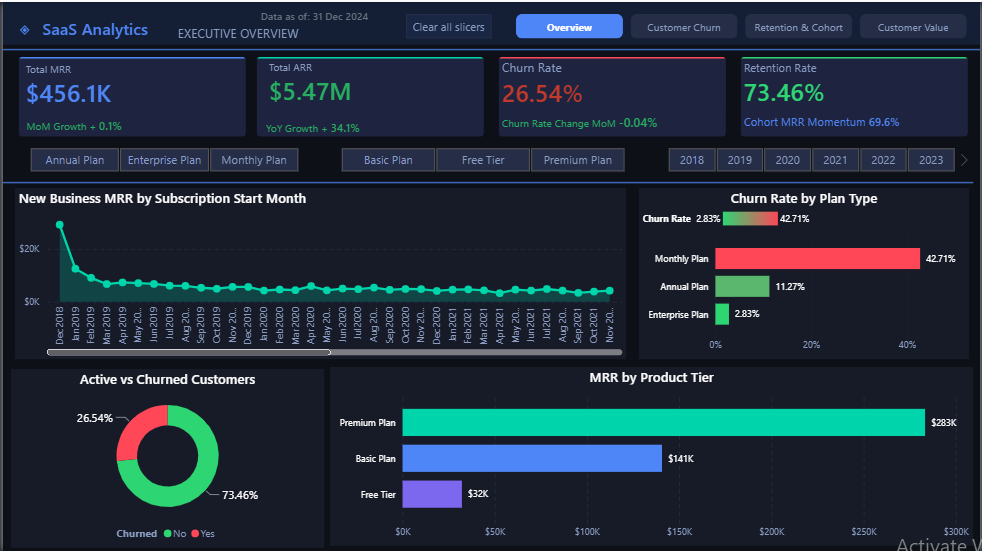
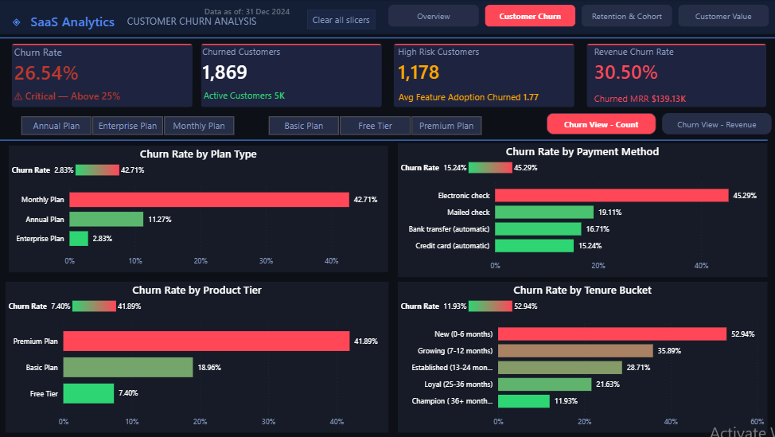
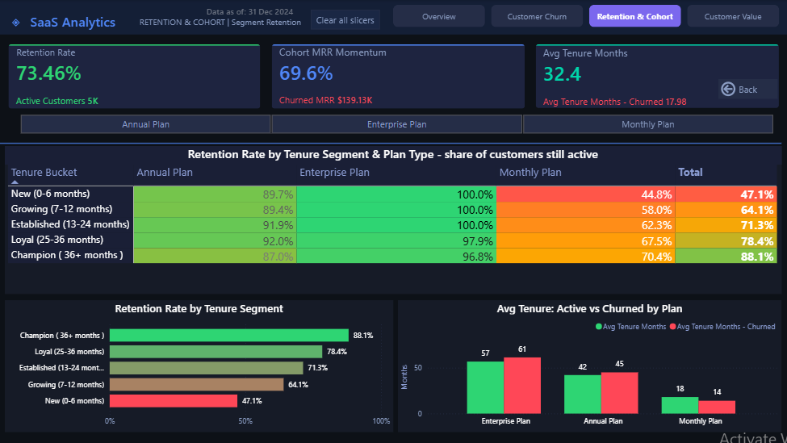
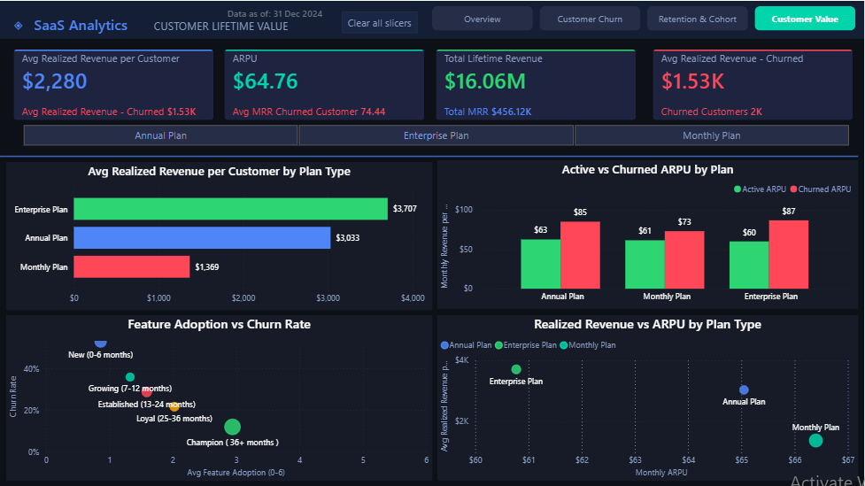

# SaaS Subscription & Churn Analytics Dashboard

**Power BI | DAX | Power Query | SQL | Data Modeling**



---

## Business Problem

A mid-size SaaS company had no single source of truth for subscription health. Leadership couldn't identify which customer segments were churning, why revenue was leaking, or which cohorts had the lowest retention, making proactive intervention difficult.

---

## Solution

Built a 4-page professional Power BI dashboard covering the SaaS subscription health picture, from executive MRR overview to churn analysis, retention segmentation, cohort analysis, and customer value analysis.

---

## Dashboard Pages

| Page               | Purpose                                             | Key Visual            |
| ------------------ | --------------------------------------------------- | --------------------- |
| Executive Overview | MRR, ARR, Churn Rate, Retention KPIs                | MRR Trend Area Chart  |
| Customer Churn     | Churn breakdown by plan, tier, payment, tenure      | Churn Analysis Charts |
| Retention & Cohort | Retention analysis by tenure segment and plan type  | Retention Heatmap     |
| Customer Value     | Realized revenue, ARPU, and customer value analysis | Scatter + Bar Charts  |

---

## Key Findings

* Monthly Plan customers show substantially higher churn than Enterprise Plan customers.
* Electronic check customers show higher churn within the analyzed dataset.
* Lower feature adoption is associated with higher churn in the analyzed dataset.
* Customer risk segmentation highlights customers requiring further retention analysis.
* Longer-tenure customer segments show stronger retention within the snapshot analysis.
* Enterprise customers show higher realized revenue than Monthly Plan customers.

> **Note:** These findings describe patterns in the analyzed portfolio dataset. They are not claimed as results from a real client deployment.

---

## KPIs Tracked

`MRR` · `ARR` · `Churn Rate (Logo)` · `Revenue Churn Rate` ·
`Retention Rate by Tenure Segment` · `Cohort MRR Momentum` · `ARPU` ·
`Avg Realized Revenue per Customer` · `Avg Realized Revenue - Churned` ·
`Avg Tenure Months` · `MoM Growth` · `YoY Growth` ·
`Rolling 12M MRR` · `High Risk Customers`

---

## Technical Implementation

### Data Modeling

* Star-schema-oriented model using `Fact_Subscriptions`, `Dim_Customers`, and `Dim_Date`
* Calendar table covering 2018–2024 with 2,557 continuous dates
* Subscription Start Date engineered from available tenure information
* `Dim_Date` configured as the model date table
* Relationships validated and preserved during development

### DAX

* Approximately 40 measures across multiple business areas
* `CALCULATE`, `DATEADD`, `SAMEPERIODLASTYEAR`, `DATESINPERIOD`, `VAR`, and `SWITCH`
* Conditional formatting measures
* Dynamic filtering and segmentation
* Cohort and tenure-based retention calculations
* Revenue and MRR calculations
* Customer risk analysis

### Power Query

* Reframed the IBM Telco Customer Churn dataset as a SaaS subscription analysis model
* Converted `TotalCharges` from text to numeric
* Handled blank values
* Created `Churn Flag`
* Created `Tenure Bucket`
* Created `Feature Adoption Count`
* Generated Subscription Start Date using tenure information

### Report Design

* Custom dark SaaS dashboard theme
* Consistent KPI card grid
* Page navigation
* Bookmark-driven Count/Revenue toggle on Customer Churn
* Reset filters functionality
* Retention heatmap
* Modern MRR trend area chart
* Interactive slicers
* Drill-through/navigation functionality
* Portfolio-focused dashboard UX

---

## Data & Modeling Limitation

This project uses a **snapshot-style customer dataset** rather than a full subscription event-history dataset.

Therefore:

* Retention metrics are interpreted at the available customer/tenure segment level.
* Cohort analysis does not represent longitudinal customer survival tracking.
* `Cohort MRR Momentum` is a start-cohort MRR comparison and is not presented as true Net Revenue Retention.
* `Avg Realized Revenue per Customer` represents realized revenue in the available data and is not presented as predictive Customer Lifetime Value.
* Time-intelligence calculations based on Subscription Start Date represent the available start-cohort/new-business basis rather than a complete historical MRR ledger.

These limitations are intentionally documented so that the dashboard does not overstate what the underlying data can support.

---

## Dataset

**IBM Telco Customer Churn Dataset**, originally published for customer churn analysis and reframed here as a SaaS subscription analytics model.

* 7,043 customers
* Snapshot-style customer dataset
* Subscription and customer attributes
* Churn information
* Tenure information
* Revenue-related fields

Source: Kaggle

---

## Tools Used

| Tool                          | Purpose                                 |
| ----------------------------- | --------------------------------------- |
| Power BI Desktop              | Dashboard development and validation    |
| Power Query / M               | Data transformation and preparation     |
| DAX                           | Analytics and KPI development           |
| Power BI PBIP/PBIR            | Source-controlled report structure      |
| Power BI Modeling MCP         | Semantic model authoring and validation |
| Power BI Report Authoring CLI | PBIR report-layer work                  |
| pbi-cli                       | Power BI development and diagnostics    |
| MySQL                         | SQL-based data preparation/reference    |
| Git / GitHub                  | Portfolio version control               |

---

## Screenshots

### Executive Overview


### Customer Churn



### Retention & Cohort



### Customer Value



---

## Project Structure

```text
saas-churn-analytics-dashboard/
│
├── powerbi/
│   ├── SaaS_Churn_Dashboard.pbip
│   ├── SaaS_Churn_Dashboard.Report/
│   └── SaaS_Churn_Dashboard.SemanticModel/
│
├── data/
│   ├── raw/
│   
│
├── docs/
│   ├── business-requirements.md
│   ├── data-model.md
│   ├── dax-measures.md
│   ├── dashboard-guide.md
│   ├── assumptions.md
│   ├── data-dictionary.md
│   ├── validation-report.md
│   └── portfolio-case-study.md
│
├── images/
│   └── screenshots/
│       ├── page1_executive_overview.png
│       ├── page2_customer_churn.png
│       ├── page3_retention_cohort.png
│       └── page4_customer_value.png
│
├── README.md
├── LICENSE
└── .gitignore
```

---

## Validation

The project was developed through controlled phases covering:

* Baseline project audit
* Page 3 visual troubleshooting
* Semantic model corrections
* DAX and metric-definition review
* Time-intelligence review
* UX and visual design improvements
* Business narrative audit
* Documentation
* PBIR validation
* Final repository organization

PBIR validation was completed successfully with **152 files and 0 validation errors** during the final documented validation stage.

The project preserves the existing relationships and avoids unsupported relationships such as the previously rejected Tenure Bucket Sort relationship.

---

## Learning Outcomes

* End-to-end Power BI dashboard development
* Star-schema-oriented data modeling
* Advanced DAX development
* Power Query M transformations
* SaaS churn and retention analytics
* Cohort and tenure segmentation
* Customer risk analysis
* Revenue and MRR analytics
* Interactive Power BI UX
* Bookmark and navigation design
* PBIP/PBIR source-controlled Power BI development
* Technical documentation
* GitHub portfolio organization
* Validation and quality assurance

---

## Portfolio Positioning

This is a **portfolio project created to demonstrate Power BI development and analytics capabilities**.

It is not presented as a deployed production solution for a real client, and no client business impact or financial outcome is claimed.

---

## Author

**Ajay Kumar**
Power BI Developer & Data Analyst

📧 [ajthakur7273@gmail.com](mailto:ajthakur7273@gmail.com)
🔗 [LinkedIn](https://linkedin.com/in/ajay6469)
🌐 [GitHub Portfolio](https://github.com/ajay-data-analyst)

**India · Remote Global · Open to Freelance & Full-Time**
